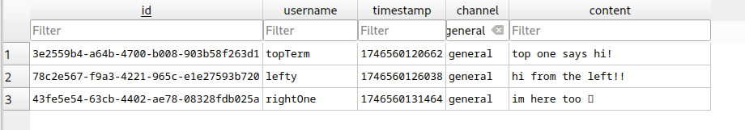

# chatapp

Small & lightweight go webserver & chat client for an instant chat messenging app in your terminal.  
You can choose a username and a channel to connect to, and then start chatting with others (or just yourself).

## Demo

## Communication

We establish a real-time persistent communication between the client and the server via [WebSocket](https://en.wikipedia.org/wiki/WebSocket).  
WebSocket runs on TCP, configure the host and port in [config.go](./models/config.go).  
The URL is `ws://<host>:<port>/channels/<channel>/user/<user>`

## Database

The server also stores the messages in a SQLite Database, as a backup log. During runtime the database is not read from, just written to.

## Run locally

1. Clone this repository
2. Install dependencies `go get ./...`

And then:

-   Run server: `go run ./server`
-   Run client: `go run ./client`  
    (To skip the prompts, run `go run ./client --dev`)

## Built with

-   [Bubble Tea](https://github.com/charmbracelet/bubbletea)
-   [go-sqlite3](https://github.com/mattn/go-sqlite3)
-   [Gorilla WebSocket](https://github.com/gorilla/websocket)

