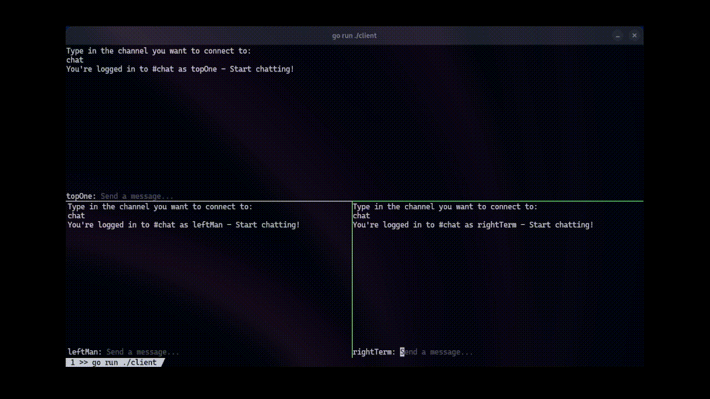

# chatapp

Small & lightweight go webserver & chat client for live chat messenging application in your terminal.  
Communication runs via http, see also the [OpenAPI Spec](./openapi.yaml).

You can choose a username and a channel to connect to, and then start chatting with others or just yourself.

## Demo

## Run locally

1. Clone this repository
2. Install dependencies `go get ./...`

And then:

-   Run server: `go run ./server`
-   Run client: `go run ./client`

## Built with

-   [Bubbletea](https://github.com/charmbracelet/bubbletea)
-   [go-sqlite3](https://github.com/mattn/go-sqlite3)

